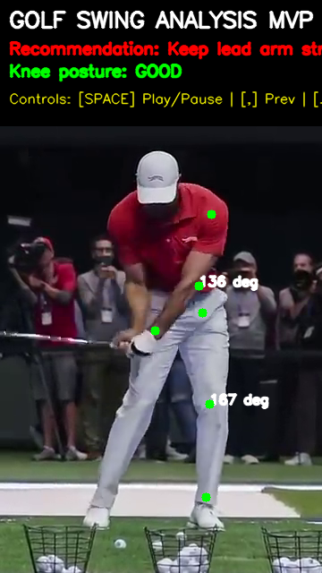
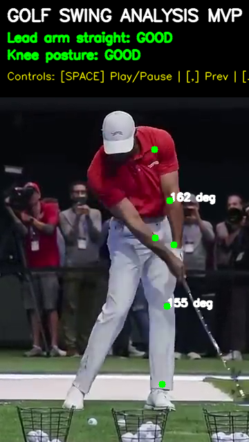
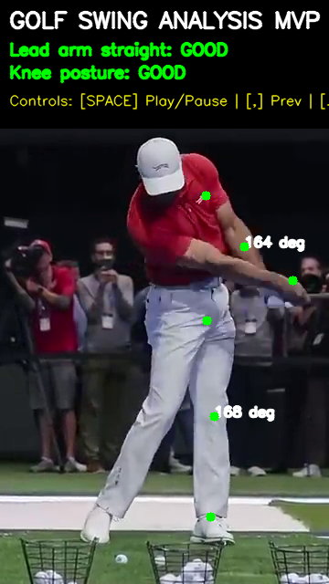

# Golf Swing Analyzer

A Python-based minimum viable product (MVP) tool that uses computer vision to analyze a golf swing from prerecorded videos. This tool leverages Google's MediaPipe Pose Landmarker to extract real-time joint positions and calculate critical geometric angles to provide immediate posture recommendations.

## Features
- **Video Processing**: Parse prerecorded `.mp4` video files to analyze your swing in any setting without needing a live webcam.
- **Pose Estimation**: Extracts body landmarks using the lightweight MediaPipe Tasks Vision API for extremely fast and accurate tracking.
- **Angle Calculation**: Evaluates core golf mechanics:
  - **Lead Arm Extension**: Calculates the angle between your lead shoulder, elbow, and wrist.
  - **Athletic Posture (Knee Flexion)**: Calculates the angle between your lead hip, knee, and ankle.
- **Live UI Overlay**: Displays an on-screen heads-up display showing your current angles alongside personalized, real-time feedback (e.g., "Keep lead arm straight", "Add knee bend").
- **Keyframe Extraction**: Includes full playback controls. Pause the video at the exact moment of impact and extract an annotated PNG screenshot!

## Sample Analysis
Here are some sample pose estimation frames extracted from the analyzer at different stages of a golf swing (address, backswing, and impact):

|            Address            |           Backswing           |            Impact             |
| :---------------------------: | :---------------------------: | :---------------------------: |
|  |  |  |

## Prerequisites
- Python 3.10+
- Visual Studio build tools (required for OpenCV on some Windows setups)

## Installation

1. **Clone the repository** (or download the files):
   ```bash
   git clone https://github.com/YourUsername/golf-swing-analyzer.git
   cd golf-swing-analyzer
   ```

2. **Create and activate a virtual environment**:
   ```bash
   python -m venv venv
   # On Windows:
   venv\Scripts\activate
   ```

3. **Install dependencies**:
   ```bash
   pip install -r requirements.txt
   ```

4. **Model Setup**:
   The script requires the lightweight pose landmarker model. It should already be included as `pose_landmarker_lite.task` in the root directory.

## Usage

Place the video file you want to analyze into the repository directory, then run the analyzer via the command line:

```bash
python analyze_swing.py YOUR_VIDEO_NAME.mp4
```

### Controls
Once the video player window opens, you can control the playback using your keyboard:
- `SPACEBAR`: Play or pause the video. Fast-paced swings are best analyzed when paused!
- `,` (Comma): While paused, step **backward** exactly one frame.
- `.` (Period): While paused, step **forward** exactly one frame.
- `s`: Save an annotated screenshot (`.png`) of the currently displayed frame to your folder.
- `q`: Quit the program early.

## Testing

This repository includes unit tests built with `pytest` to guarantee the geometric mathematical functions are accurate.

To run the tests:
```bash
pytest test_analyze_swing.py
```
